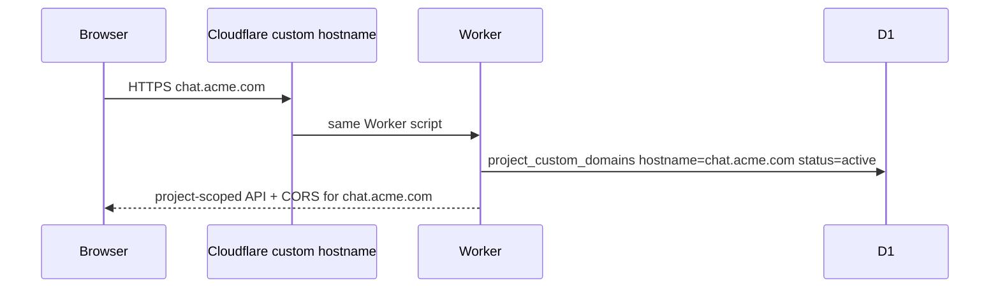

# Custom domain white-label (P12-G)

Route `https://chat.yourcompany.com` to a FluxyChat **project** on the Worker. Useful for embed widgets (P12-A), guest chat, and branded API endpoints without exposing the platform `api.*` hostname.

## How it works



1. **Register** hostname in dashboard `/custom-domains` (status `pending`).
2. **Attach** custom hostname in Cloudflare (for SaaS or Workers custom domain) with TLS.
3. **Activate** domain in dashboard (`status: active`) once DNS + certificate are ready.
4. Requests to that host resolve `projectId` from the hostname (no API key required).
5. JWTs must match the host project (`tid` claim enforced).

## Operator checklist

| Step | Action |
|------|--------|
| DNS / TLS | Cloudflare **Custom Hostnames** or Worker custom domain → same Worker |
| Worker env | `WORKER_PLATFORM_HOSTS=api.fluxychat.com,fluxychat-worker.workers.dev` (comma-separated platform hosts that skip white-label lookup) |
| CORS | Per-domain `allowedOrigins` on the domain row + auto `https://\{hostname\}` |
| Default room | Optional `defaultRoomId` for embed / guest landing |
| Guest chat | `GET /public/host-config` returns `\{ projectId, defaultRoomId, brand \}` |

## API

| Method | Path | Auth | Purpose |
|--------|------|------|---------|
| `GET` | `/public/host-config` | none | Discover project from request hostname |
| `GET` | `/admin/custom-domains` | admin JWT | List domains for project |
| `POST` | `/admin/custom-domains` | admin JWT | Register hostname |
| `PATCH` | `/admin/custom-domains/:id` | admin JWT | Activate / disable / branding |
| `DELETE` | `/admin/custom-domains/:id` | admin JWT | Remove mapping |

## SDK

```ts
const config = await client.getPublicHostConfig();
const { domains } = await client.listCustomDomains();
await client.createCustomDomain({ hostname: "chat.acme.com", defaultRoomId: "support" });
await client.updateCustomDomain(id, { status: "active" });
```

## Security

- Hostname must be a valid DNS name (no `www.` prefix — use `chat.` subdomains).
- Guest sessions on a custom host only work for rooms in that project.
- Cross-tenant JWTs are rejected on white-label hosts.

## Theming and `data-theme` (P14-I)

White-label the chat shell on your marketing site and embed iframe:

1. Set **`data-theme`** on the host page (or `&lt;html&gt;`) so your CSS can scope brand tokens:

```html
<html lang="en" data-theme="acme">
  <head>
    <style>
      [data-theme="acme"] {
        --fluxy-primary: #0d9488;
        --fluxy-surface: #f0fdfa;
        --fluxy-text: #134e4a;
      }
    </style>
  </head>
```

2. Configure embed theme in dashboard **Embed widget** — saves `primaryColor` and launcher position; the generated snippet includes `data-primary-color` and `data-position`.

3. On custom domains, `GET /public/host-config` returns optional `brand` JSON — use it to set `data-theme` dynamically:

```ts
const host = await client.getPublicHostConfig();
document.documentElement.setAttribute("data-theme", host.brand?.themeId ?? "default");
```

4. For full SDK embeds (not the bubble), pass the same CSS variables into your React app wrapping `@fluxy-chat/ui` components.

## Related

- [Embeddable chat widget](/docs/embed-widget)
- [Hosted domains (fluxychat.com setup)](/docs/hosted-domains)

