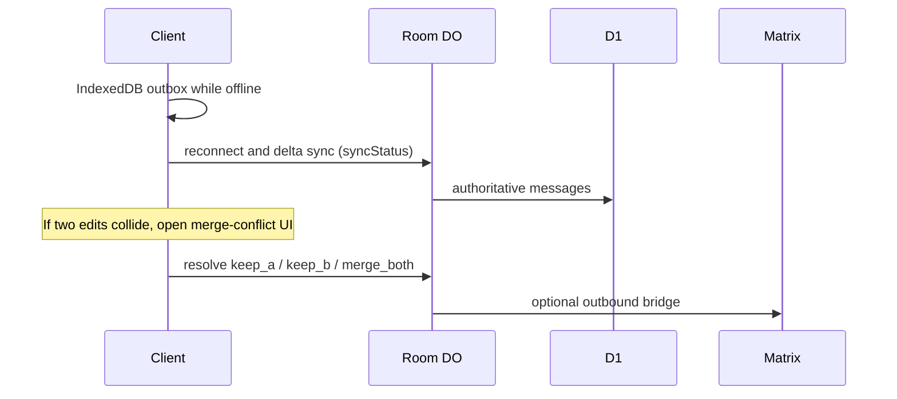

Offline sync, Matrix federation, and merge conflicts are related problems. FluxyChat handles them as one story instead of three disconnected features.

## The loop

## Pieces

| Layer | What | Where |
|-------|------|--------|
| Offline-first | WS events, pending send queue, `syncStatus` | `@fluxy-chat/sdk`, React Native outbox |
| Authoritative room | Durable Object and D1 history | Worker Room DO |
| Conflict UI | Side-by-side resolve when edits diverge | [Merge conflicts](/docs/features/merge-conflicts) |
| Federation | Matrix appservice bridge in and out | Bridge routes and docs |

## Operator checklist

1. Enable offline-first in the SDK (`offlineFirst: true`, default on web).
2. Show a connection banner when `syncStatus` is `offline` or `pending`.
3. Wire `MergeConflictPanel` (or your own UI) on `deliveryConflict` and the pending merge API.
4. For multi-org Matrix, configure the bridge and verify inbound traffic with the webhook emulator suite.

## How this compares

| Capability | Stream-style | Matrix-only | FluxyChat |
|------------|--------------|-------------|-----------|
| Offline queue | SDK local cache | Client cache | IndexedDB or RN outbox plus `syncStatus` |
| Conflict UX | Usually last-write-wins | Room state | Explicit merge panel |
| Federation | Limited | Native | Optional Matrix bridge |

## Related

- [Merge conflicts (CRDT)](/docs/features/merge-conflicts)
- [Edge room history](/docs/guides/realtime/edge-room-history)
- [React Native quickstart](/docs/guides/ecosystem/react-native-quickstart)
