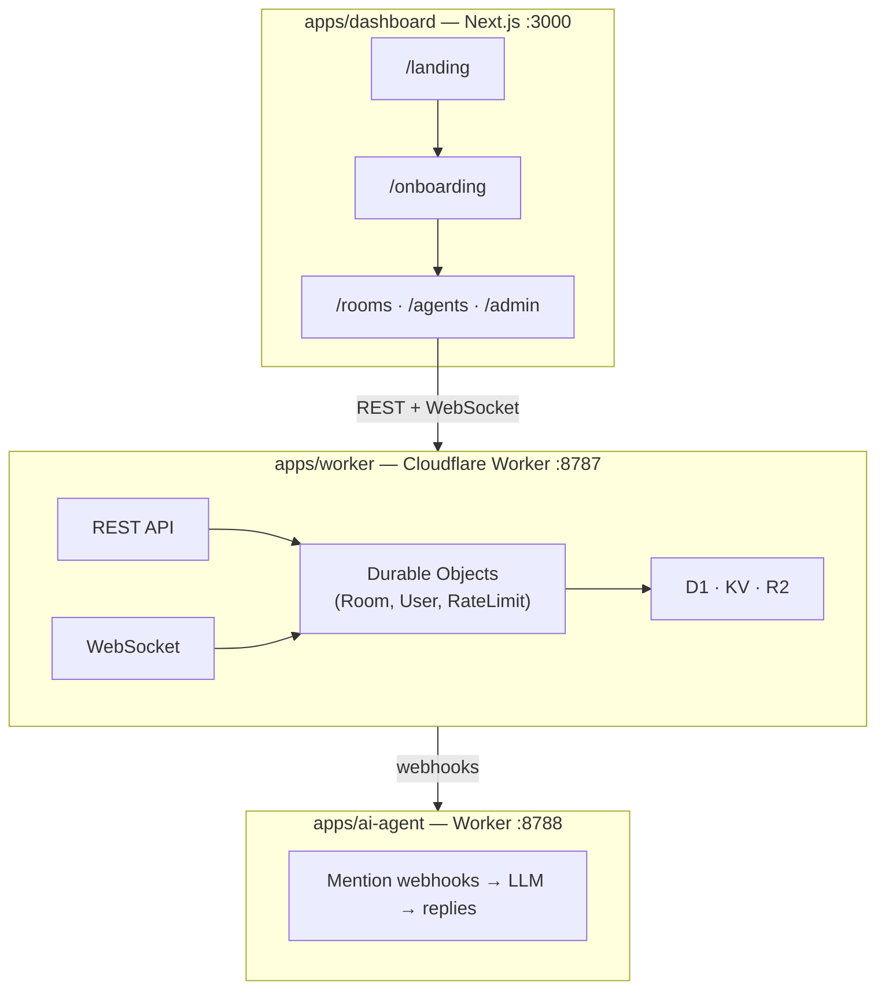

## Prerequisites

| Tool | Minimum | Notes |
|------|---------|-------|
| **Node.js** | 18.x (20+ recommended) | Required for all apps and scripts |
| **pnpm** | 8.x | Monorepo package manager (`corepack enable && pnpm install -g pnpm`) |
| **Git** | 2.x | |
| **Cloudflare account** (optional) | — | Only needed for remote D1/R2 binding or deployment |
| **Clerk account** (optional) | — | Only needed if you want auth UI; dashboard works without it |

> **Without a Cloudflare account**, `wrangler dev` creates local D1/KV/R2 bindings automatically via Miniflare. You only need real bindings for production deployment.

---

## 1. Clone & Install

```bash
git clone https://github.com/AlessandroFare/fluxychat.git
cd fluxychat
pnpm install
```

## 2. Environment Setup

Run the automated setup script — it copies template files without overwriting existing ones:

```bash
pnpm run dev:setup
```

This creates:
- `apps/worker/.dev.vars` ← from `.dev.vars.example`
- `apps/dashboard/.env.local` ← from `.env.example`

### Worker: `apps/worker/.dev.vars`

For basic local dev, you only need these entries:

```ini
# Required for project provisioning
ALLOW_DEV_PROVISION=true

# Optional — enable hosted multi-tenant mode
HOSTED_MULTI_TENANT=true
FLUXY_PLATFORM_PROJECT_ID=<your-uuid-or-omit>

# Optional — AI/LLM provider keys (uncomment what you use)
# AI_API_KEY=sk-...
# ANTHROPIC_API_KEY=sk-ant-...
# OPENROUTER_API_KEY=sk-or-...
# GROQ_API_KEY=gsk_...
# DEEPSEEK_API_KEY=sk-...
# OLLAMA_BASE_URL=http://localhost:11434   # for local models

# Optional — feature flags
FEATURE_VOICE_MESSAGES=true
FEATURE_REPLY_SUGGESTIONS=true
```

The full template (`apps/worker/.dev.vars.example`) documents 100+ variables covering Stripe, rate limits, SMS OTP, push notifications, quotas, and more. Most default to sensible values — only set what you need.

### Dashboard: `apps/dashboard/.env.local`

```ini
# Point dashboard at your local worker
NEXT_PUBLIC_FLUXYCHAT_WORKER_URL=http://127.0.0.1\:8787

# Optional — Clerk auth (omit for manual quickstart mode)
# NEXT_PUBLIC_CLERK_PUBLISHABLE_KEY=pk_test_...
# CLERK_SECRET_KEY=sk_test_...
# NEXT_PUBLIC_CLERK_SIGN_UP_FALLBACK_REDIRECT_URL=/onboarding

# Optional — console gate (skip for local dev)
# CONSOLE_GATE_SECRET=your-secret-here
```

> **Without Clerk**: The dashboard runs in manual mode — you'll use the `/onboarding` flow to enter a Worker URL and API key directly. The `UserButton` and sign-in/sign-up buttons are hidden.

### AI Agent: `apps/ai-agent/.dev.vars`

Only needed if you want the AI agent service running alongside the worker:

```ini
FLUXY_BASE_URL=http://127.0.0.1\:8787
JWT_SECRET=local-dev-secret
# OPENAI_API_KEY=sk-...
```

### Verify env readiness

```bash
pnpm run check:env
```

This runs `scripts/check-env-readiness.mjs` — a pre-flight checklist that catches missing or inconsistent values.

---

## 3. Start Dev Servers

### All apps in parallel (recommended)

```bash
pnpm dev
```

This uses Turbo to run `dev` across `apps/*` in parallel:
- **Worker** → `http://127.0.0.1:8787` (Wrangler + Miniflare)
- **Dashboard** → `http://localhost:3000`
- **AI Agent** → `http://127.0.0.1:8788` (Wrangler)

### Individual apps

```bash
# Worker only
cd apps/worker && pnpm dev

# Dashboard only (needs worker running for API calls)
cd apps/dashboard && pnpm dev

# AI Agent only (needs worker running for webhooks)
cd apps/ai-agent && pnpm dev
```

### Build order

Turbo handles this automatically for `pnpm build`, but if you build manually:

```
@fluxy-chat/protocol → @fluxy-chat/sdk → @fluxy-chat/ui → @fluxy-chat/agent → apps/dashboard
```

The dashboard's `build` script in `package.json` chains these for you.

---

## 4. First Project & Message

### Option A: Dashboard onboarding (GUI)

1. Open `http://localhost:3000/onboarding`
2. **With Clerk**: Sign up/in → the dashboard auto-connects
3. **Without Clerk**: Enter your Worker URL (`http://127.0.0.1:8787`) and click "Connect"
4. The onboarding wizard walks you through:
   - Project creation (auto-provisioned via `ALLOW_DEV_PROVISION=true`)
   - JWT minting (admin + member tokens)
   - First room creation
   - First message (celebrates with confetti when sent)

### Option B: Terminal quickstart (90 seconds)

```bash
pnpm run first-message
```

This script:
1. Starts a local Worker (inline Miniflare)
2. Provisions a project
3. Mints an admin JWT
4. Creates a room
5. Sends a message
6. Prints the JWT and room ID for SDK use

### Option C: Manual curl

```bash
# Mint a project-scoped JWT
curl -X POST "http://127.0.0.1\:8787/auth/token" \
  -H "Content-Type: application/json" \
  -H "X-Fluxy-Api-Key: fc_your_api_key" \
  -d '{"userId":"alice","roles":["admin"],"ttlSeconds":3600}'

# Create a room
curl -X POST "http://127.0.0.1\:8787/rooms" \
  -H "Authorization: Bearer <JWT>" \
  -H "Content-Type: application/json" \
  -d '{"name":"general","isPublic":true}'

# Send a message
curl -X POST "http://127.0.0.1\:8787/rooms/<roomId>/messages" \
  -H "Authorization: Bearer <JWT>" \
  -H "Content-Type: application/json" \
  -d '{"content":"Hello from local dev!"}'
```

---

## 5. Testing Realtime (WebSocket)

### SDK hook

```tsx
import { FluxyChatClient, useChat } from "@fluxy-chat/sdk";

const client = new FluxyChatClient({
  baseUrl: "http://127.0.0.1\:8787",
  userId: "alice",
  token: "<your-member-jwt>",
});

function ChatRoom() {
  const { messages, sendMessage } = useChat({ roomId: "general", client });

  return (
    <div>
      {messages.map((m) => (
        <div key={m.id}>{m.content}</div>
      ))}
      <input
        onKeyDown={(e) => {
          if (e.key === "Enter") sendMessage(e.currentTarget.value);
        }}
      />
    </div>
  );
}
```

### Raw WebSocket test

```bash
# Connect to a room's WebSocket
wscat -c "ws://127.0.0.1\:8787/rooms/general/ws?userId=alice&token=<JWT>"
```

---

## 6. Testing Agents

### Create an agent

```bash
curl -X POST "http://127.0.0.1\:8787/agents" \
  -H "Authorization: Bearer <JWT>" \
  -H "Content-Type: application/json" \
  -d '{
    "name": "Support Bot",
    "handle": "support",
    "provider": "openai",
    "model": "gpt-4o-mini",
    "capabilities": ["chat"],
    "systemPrompt": "You are a helpful support assistant."
  }'
```

### Invoke via curl

```bash
curl -X POST "http://127.0.0.1\:8787/agents/<agentId>/invoke" \
  -H "Authorization: Bearer <JWT>" \
  -H "Content-Type: application/json" \
  -d '{"roomId":"general","content":"What is FluxyChat?"}'
```

### Via the dashboard

1. Navigate to **Agents** in the sidebar
2. Click **Create agent** → fill in provider, model, system prompt
3. Open a room → type `@support <message>` to trigger the agent

> **AI Agent Service**: For webhook-triggered agents (mention-based), ensure `apps/ai-agent` is running and its `.dev.vars` has the correct `FLUXY_BASE_URL` and `JWT_SECRET`.

---

## 7. Common Tasks

### Run tests

```bash
# All packages
pnpm test

# Worker unit tests
cd apps/worker && pnpm test

# Dashboard unit tests
cd apps/dashboard && pnpm test

# Worker e2e tests (requires running worker)
cd apps/worker && pnpm test:e2e

# Dashboard e2e smoke tests (Playwright)
cd apps/dashboard && pnpm test:e2e:smoke
```

### Lint

```bash
pnpm lint
```

### Smoke test the worker API

```bash
# Against a remote deployment
cd apps/worker && pnpm smoke:remote -- --base-url https://your-worker.your-subdomain.workers.dev --admin-jwt <JWT>

# Bundled end-to-end (auth → room → message → GDPR)
export TEST_API_KEY=fc_...
pnpm smoke:bundled
```

### Provisions / bootstrap

```bash
# Create platform project (for hosted multi-tenant mode)
pnpm run provision:bootstrap
```

---

## 8. Clerk Setup (Optional)

If you want the full hosted experience with Clerk auth:

1. **Create a Clerk application** at [clerk.com](https://clerk.com)
2. Get your **Publishable Key** (`pk_test_...`) from Clerk Dashboard → API Keys
3. Get your **Secret Key** (`sk_test_...`) from the same page (server-only)
4. Add to `apps/dashboard/.env.local`:

   ```ini
   NEXT_PUBLIC_CLERK_PUBLISHABLE_KEY=pk_test_...
   CLERK_SECRET_KEY=sk_test_...
   NEXT_PUBLIC_CLERK_SIGN_UP_FALLBACK_REDIRECT_URL=/onboarding
   ```

5. Restart the dashboard dev server

> Clerk middleware in `apps/dashboard/middleware.ts` automatically activates when both keys are present. Without them, the middleware is a no-op and all routes are public.

### Clerk webhook (for auto-provisioning)

To auto-create FluxyChat projects when users sign up:

1. In Clerk Dashboard → Webhooks → Add Endpoint
2. URL: `https://your-dashboard.com/api/webhooks/clerk`
3. Subscribe to `user.created` events
4. Copy the **Signing Secret** (`whsec_...`) to:

   ```ini
   CLERK_WEBHOOK_SIGNING_SECRET=whsec_...
   DASHBOARD_PUBLIC_URL=https://your-dashboard.com
   ```

---

## 9. Troubleshooting

| Symptom | Cause | Fix |
|---------|-------|-----|
| Worker 502 on startup | Miniflare D1 not initialized | `cd apps/worker && npx wrangler d1 migrations apply fluxychat --local` |
| Dashboard "No active project" | JWT not in session | Go through `/onboarding` or set JWT in `localStorage` |
| WebSocket connection refused | Worker not running | Ensure `pnpm dev` or `cd apps/worker && pnpm dev` is running |
| Clerk sign-in loop | Missing redirect URLs | Set `NEXT_PUBLIC_CLERK_SIGN_UP_FALLBACK_REDIRECT_URL=/onboarding` |
| `UserButton` invisible | Clerk not configured | Add `NEXT_PUBLIC_CLERK_PUBLISHABLE_KEY` — or use manual quickstart mode |
| Agent invoke timeout | No LLM API key in `.dev.vars` | Add `AI_API_KEY` or provider-specific key to `apps/worker/.dev.vars` |
| Build error: `@fluxy-chat/sdk` not found | Packages not built | Run `pnpm build` from repo root (Turbo handles order) |
| Voice messages not working | Feature flag off | Set `FEATURE_VOICE_MESSAGES=true` in `apps/worker/.dev.vars` |

For more troubleshooting, see [Troubleshooting](/docs/reference/troubleshooting).

---

## 10. Architecture Quick Reference



### Key ports

| Service | Port | Protocol |
|---------|------|----------|
| Dashboard | 3000 | HTTP (Next.js) |
| Worker | 8787 | HTTP + WebSocket (Wrangler) |
| AI Agent | 8788 | HTTP (Wrangler) |
