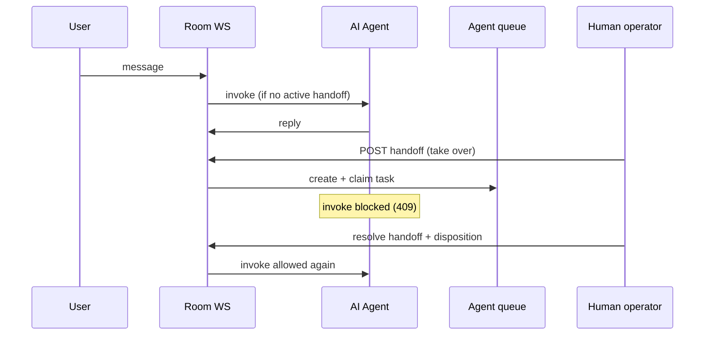

FluxyChat supports Intercom-Fin-style flows: an in-room AI agent responds until a human operator takes over. Handoff pauses AI invokes, enqueues an agent task with thread context, and resumes AI when the handoff completes.

## Architecture



## API

| Method | Path | Role | Action |
|--------|------|------|--------|
| `GET` | `/rooms/{roomId}/handoff` | member+ | Current handoff state |
| `POST` | `/rooms/{roomId}/handoff` | moderator/admin/owner | Take over from AI |
| `PATCH` | `/rooms/{roomId}/handoff` | moderator/admin/owner | Complete with disposition |

Disposition codes: `GET /agent-queue/dispositions` (shared with agent queue wrap-up).

## SDK

```ts
import { FluxyChatClient } from "@fluxy-chat/sdk";

const client = new FluxyChatClient({ baseUrl, userId, token });

const { handoff } = await client.getRoomHandoff(roomId);

await client.requestRoomHandoff(roomId, {
  agentId: "support_lead",
  note: "VIP customer — billing issue",
});

await client.resolveRoomHandoff(roomId, "resolved");
```

While handoff is active, `POST /agents/:id/invoke` and `@mention` agent invokes return `409 human_handoff_active`.

## Dashboard

| Surface | Component / route |
|---------|-------------------|
| Room chat | `<AgentHandoffBanner />` — Take over / Complete handoff + context preview |
| Operator queue | `/agent-queue` — SLA timers, claim, disposition picker |

Configure agents under **Agents** (`/agents`). Each agent has model, system prompt, tools, and room allowlist.

## Configure an in-room agent

1. Create agent in dashboard → copy agent id
2. Bind to room via project settings or `@agent` mention rules
3. Test invoke: `POST /agents/{id}/invoke` with `{ "roomId": "…", "prompt": "…" }`

## Human-in-the-loop patterns

| Pattern | When to use |
|---------|-------------|
| **Room handoff** | Escalate entire thread from AI to human |
| **Tool approvals** | AI proposes an action; human approves via card button ([tool presets](/docs/guides/ai-tool-presets)) |
| **Agent queue** | Pool of operators; auto-claim on handoff |

## Database

- Migration `0056_room_handoffs.sql`
- Links to `agent_tasks` via `agent_task_id`

## Related

- [Agent queue](/docs/guides/ai-agents/agent-queue) — SLA, dispositions, wrap-up
- [Custom tools](/docs/guides/ai-agents/tool-approval-hmac) — tools the agent can call
- [Thread state](/docs/guides/thread-state) — per-thread KV for agent memory
