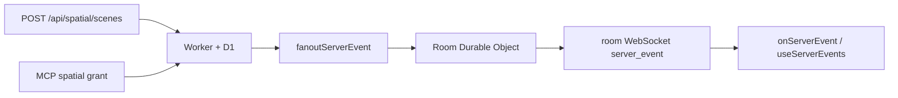

A scene is bound to a room. Create scenes, place entities, and send telemetry on the same room WebSocket as chat. There is no second realtime bus.

## Architecture



## Room WebSocket events

| Event | When |
|-------|------|
| `spatial.scene_created` | New twin scene bound to a room |
| `spatial.entity_added` | Entity placed or updated in a scene |

Subscribe from the SDK:

```ts
import { FluxyChatClient } from "@fluxy-chat/sdk";

const conn = client.connectRoom("spatial:my-project");
conn.connect();
conn.onServerEvent((ev) => {
  if (ev.name === "spatial.entity_added") {
    console.log(ev.data);
  }
});
```

Or via `useChat`:

```ts
useChat({
  roomId: "spatial:my-project",
  onServerEvent: (ev) => { /* ... */ },
});
```

## Default room binding

When `roomId` is omitted on scene create, the Worker defaults to `spatial:{projectId}` so dashboards and showcases can connect without extra configuration.

## MCP spatial grants

Spatial tools (scene lookup, entity query, AR anchor export) are exposed through **MCP Apps** with scoped grants:

1. Create an MCP identity grant in the dashboard (**MCP Apps → Spatial**).
2. Scope grants to `spatial:read`, `spatial:write`, or `spatial:export` per project.
3. The Worker validates JWT claims (`projectId`, `mcpGrantId`, allowed scopes) before returning scene payloads.

Grants are **least-privilege**: write scopes cannot export raw anchor bundles; export requires an explicit `spatial:export` scope and audit log entry.

## AR / WebXR

1. The room WebSocket delivers entity pose updates (`spatial.entity_added`).
2. `/spatial` renders a WebGL preview for operators.
3. A WebXR session can attach to the same entity stream. If WebXR is missing, the 2D map still works.

You can export ARKit / ARCore anchor bundles through MCP when `spatial:export` is granted. Exports are signed, time-limited URLs. Do not put long-lived secrets in client bundles.

## Related

- [Realtime modules](/docs/platform/realtime-modules) — full `server_event` catalog
- [Collab](/docs/platform/collab) — shared whiteboards in venue back-of-house rooms
- Dashboard: `/spatial` showcase and scene console
