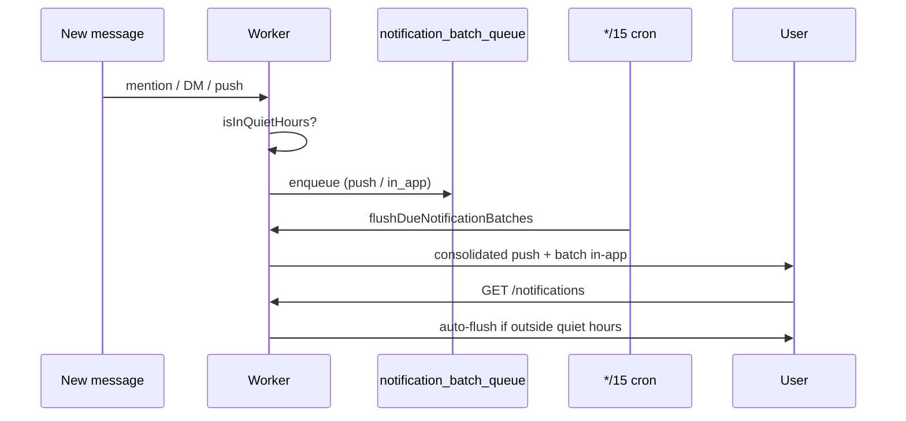

## User settings

Configure in dashboard **Notifications → Quiet hours**:

| Field | Default | Notes |
|-------|---------|-------|
| `enabled` | off | Master switch |
| `timezone` | `UTC` | IANA timezone (e.g. `Europe/Rome`) |
| `quietStart` | `22:00` | Local time HH\:MM |
| `quietEnd` | `07:00` | Supports overnight windows (22\:00→07\:00) |
| `batchPush` | on | Queue FCM + Web Push during quiet hours |
| `batchInApp` | on | Queue in-app rows during quiet hours |

## Delivery flow

## API

| Method | Path | Purpose |
|--------|------|---------|
| `GET` | `/notifications/quiet-hours` | Read prefs + `pendingBatch` + `inQuietHours` |
| `PATCH` | `/notifications/quiet-hours` | Update prefs (flushes if now outside window) |
| `POST` | `/notifications/flush-batch` | Manual flush (409 if still in quiet hours) |

## Integration points

- `maybePushNotifyOnMessage` — batches per-recipient push
- `createInAppNotification` — batches mention/DM in-app rows
- `deliverUserDigest` — defers digest web push during quiet hours
- Cron `*/15 * * * *` — `flushDueNotificationBatches`
- `GET /notifications` — auto-flush when user opens inbox outside quiet hours

## Migration

Apply D1 migration `0059_quiet_hours.sql`.

## Environment

| Variable | Default |
|----------|---------|
| `QUIET_HOURS_ENABLED` | enabled (`false` disables batching globally) |

## Wrangler

Cron trigger added: `*/15 * * * *` for batch flush.

