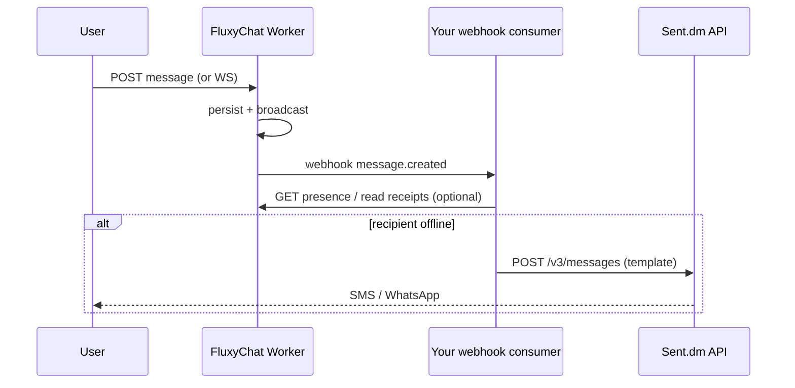

# Offline notify: in-app chat (FluxyChat) + SMS/WhatsApp (Sent.dm)

Use **FluxyChat** when the user is in your product (WebSocket + in-app notifications). Use **[Sent.dm](https://sent.dm)** when they are offline and you need transactional SMS or WhatsApp — same mental model as pairing a chat API with a telco API (see `/compare`).

Inspired by the Apache-2.0 `sent-dm-typescript` SDK in `docs/research/sent-dm-typescript-main/` (multi-channel fan-out, templates, delivery activity log). **No Sent code is vendored into FluxyChat**; you run this in your own Worker or backend.

## Architecture



## 1. Register a project webhook

In the operator console (or `POST /webhooks`), subscribe to at least:

- `message.created` — new message persisted
- Optionally `mention.created` if you add a custom automation; today mentions are in the message payload and in-app notifications.

Store the signing secret; verify `X-Fluxy-Signature` on your consumer (see [`webhook-delivery.js`](../../apps/worker/src/lib/webhook-delivery.js)).

## Built-in option (FluxyChat Worker)

When these env vars are set on the Worker, mention and DM recipients can receive SMS without a separate webhook service:

| Variable | Purpose |
|----------|---------|
| `OFFLINE_SMS_ENABLED=true` | Turn on automation |
| `SENT_DM_API_KEY` | Sent.dm API key |
| `SENT_DM_PROFILE_ID` | Sent profile id (`x-profile-id`) |
| `OFFLINE_SMS_TEMPLATE_NAME` | Template name (default `chat_notify`) |
| `OFFLINE_SMS_IDLE_MINUTES` | Skip SMS if user read the room within N minutes (default 5) |
| `OFFLINE_SMS_PER_USER_PER_HOUR` | Cap SMS per user (default 6) |
| `OFFLINE_SMS_MEDIA_ENABLED` | Include attachment `media_url` in template params (default on; set `false` to disable) |

**User opt-in** — store phone on the room member profile (no GPL import; your app controls consent):

```http
PATCH /rooms/{roomId}/members/me/preferences
Authorization: Bearer <member-jwt>
Content-Type: application/json

{
  "preferences": {
    "smsE164": "+14155551234",
    "smsOptIn": true
  }
}
```

Register a Sent.dm template `chat_notify` with parameters: `sender`, `preview`, `room_id`, and optionally **`media_url`**, **`media_name`**, **`media_type`** (`image` | `video` | `document`) for MMS / WhatsApp media (P13-T3). Define a **media** template variable in Sent.dm pointing at `media_url`.

Implementation: [`offline-notify-sent.js`](../../apps/worker/src/lib/offline-notify-sent.js) (hooked from `schedulePostMessageAutomations`).

---

## 2. Decide “offline” (custom webhook path)

Pick one or combine:

| Signal | Source | Notes |
|--------|--------|-------|
| Not connected to room WS | Your app / last-seen table | FluxyChat does not expose global presence across rooms |
| No recent read receipt | `read_receipts` in D1 | Good for “hasn’t opened this DM/thread” |
| In-app notification unread | `GET /notifications` | User has inbox row but hasn’t acked |
| Quiet hours / user prefs | Your profile store | Don’t SMS at night |

**Chatsemble-style pattern (GPL, concepts only):** org-scoped rooms + email for invites. FluxyChat equivalent: **in-app notifications** for mentions/DMs + **your** email/SMS bridge via webhooks — see [`chatsemble-concepts.md`](../research/chatsemble-concepts.md).

## 3. Webhook consumer (Worker sketch)

Deploy a separate route or Worker that:

1. Verifies the FluxyChat webhook signature.
2. Parses `message.created` (room id, author, content snippet, mentions).
3. Resolves recipient phone numbers from **your** user profile DB (never log full numbers in shared logs).
4. Skips if the recipient is considered “online” in your app.
5. Calls Sent.dm with a **template** (transactional; register templates in Sent dashboard).

```ts
// Minimal fetch example (no SDK required). Run in YOUR worker, not FluxyChat core.
const SENT_API_KEY = env.SENT_DM_API_KEY;
const SENT_PROFILE_ID = env.SENT_PROFILE_ID;

async function notifyOfflineSms({ toE164, templateName, parameters }) {
  const res = await fetch("https://api.sent.dm/v3/messages", {
    method: "POST",
    headers: {
      Authorization: `Bearer ${SENT_API_KEY}`,
      "Content-Type": "application/json",
      "x-profile-id": SENT_PROFILE_ID,
      "Idempotency-Key": crypto.randomUUID(),
    },
    body: JSON.stringify({
      channel: ["sms"],
      to: [toE164],
      template: {
        name: templateName,
        parameters,
      },
    }),
  });
  if (!res.ok) throw new Error(`sent_dm_${res.status}`);
  return res.json();
}
```

With the official SDK (`npm install @sentdm/sentdm`):

```ts
import Sent from "@sentdm/sentdm";

const sent = new Sent({ apiKey: env.SENT_DM_API_KEY });

const { data } = await sent.messages.send({
  channel: ["sms", "whatsapp"],
  to: ["+14155551234"],
  template: {
    name: "chat_mention",
    parameters: { sender: "Alex", preview: "Hey — can you review…" },
  },
  "x-profile-id": env.SENT_PROFILE_ID,
});

// data contains per-recipient message ids — track delivery via webhooks or GET /v3/messages/{id}
```

## 4. Template content

Keep SMS short; deep-link into your app:

- `sender` — display name
- `preview` — first 80 chars of message (strip HTML)
- `room_url` — `https://app.example.com/rooms/{roomId}`
- `media_url` — first image (or video/document) attachment URL; relative `/attachments/*` paths are resolved with `PUBLIC_APP_URL`
- `media_name` — file name for the attachment
- `media_type` — `image`, `video`, or `document` (Sent.dm channel adaptation)

Register templates in Sent.dm; avoid free-form body for production (compliance + deliverability).

## 5. Delivery debugging

Sent.dm exposes:

- `GET /v3/messages/{id}` — status
- `GET /v3/messages/{id}/activities` — lifecycle (accepted → sent → delivered / failed)

Log FluxyChat `webhook_deliveries` id alongside Sent message id in your support tooling.

## 6. Security & compliance

- Minimize PII in webhook logs; redact message bodies in Sent parameters when possible.
- Opt-in SMS per region (TCPA, GDPR). Store `sms_opt_in` on the user profile.
- Rate-limit outbound SMS per user (Sent profile limits + your own caps).
- Never expose `SENT_DM_API_KEY` to the browser — only server/Worker.
- **US production:** follow the [US SMS compliance playbook](../operations/us-sms-compliance-playbook.md) (10DLC, STOP/HELP, opt-out webhook mirror via `sent_dm_contacts`).

## Related

- [Public demo hardening](./public-demo-hardening.md) — Turnstile + origin allowlist for guest demos
- [In-app notifications](../../apps/worker/src/lib/in-app-notifications.js) — mention/DM rows in D1
- [Transport fallback](./transport-fallback.md) — WS → SSE when mobile backgrounded
- [Compare: telco vs in-app](https://fluxychat.com/compare) — positioning
