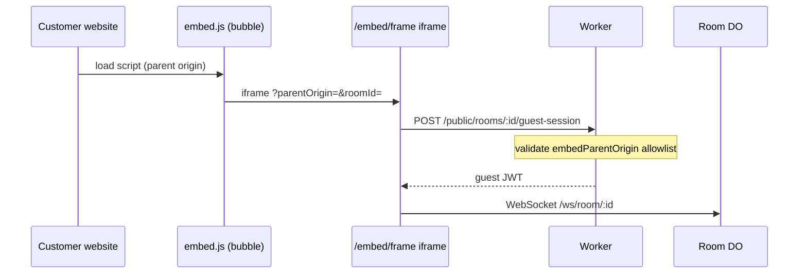

# Embeddable chat widget (P12-A)

One-line install for a support chat bubble on any website, powered by public guest sessions (P10-SB6) and optional custom domains (P12-G).

## Quick start

1. Open dashboard **Embed widget** (`/embed`).
2. Set a **public room** as `defaultRoomId`.
3. Add **allowed parent origins** (e.g. `https://www.acme.com`).
4. Copy the generated `<script>` snippet before `</body>`.

```html
<script
  src="https://chat.acme.com/embed.js"
  data-fluxy-api-url="https://chat.acme.com"
  data-room-id="room_support"
  data-z-index="2147483000"
  async
></script>
```

## Architecture



## Security

| Control | Purpose |
|---------|---------|
| **Origin allowlist** | `allowedOrigins` on embed config + active custom-domain origins |
| **embedParentOrigin** | Iframe passes parent page origin; guest-session rejects unknown sites |
| **Z-index sandbox** | Launcher uses configurable high z-index without touching page CSS |
| **iframe sandbox** | `allow-scripts allow-same-origin allow-forms allow-popups` |
| **Global kill switch** | `EMBED_WIDGET_ENABLED=false` disables `/embed.js` and public config |

## API

| Method | Path | Auth | Purpose |
|--------|------|------|---------|
| `GET` | `/embed.js` | none | Vanilla IIFE loader |
| `GET` | `/embed/frame` | none | Chat shell (iframe target) |
| `GET` | `/public/embed-config` | none | Public widget metadata |
| `GET` | `/admin/embed-config` | JWT admin | Read config + snippet |
| `PATCH` | `/admin/embed-config` | JWT admin | Enable / theme / origins |

## Environment

| Variable | Default | Notes |
|----------|---------|-------|
| `EMBED_WIDGET_ENABLED` | enabled | Set `false` to disable widget globally |
| `PUBLIC_GUEST_ALLOWED_ORIGINS` | — | Still applies to guest-session |
| `PUBLIC_GUEST_READ_ONLY` | read-only guests | When `false`, embed visitors can send messages |

## Custom domains

Serve `embed.js` from `https://chat.yourcompany.com` (P12-G) so API, iframe, and WebSocket share the same origin. Parent marketing site origins still go in the embed allowlist.

## Migration

Apply D1 migration `0058_embed_widget.sql` (`project_embed_configs`).
