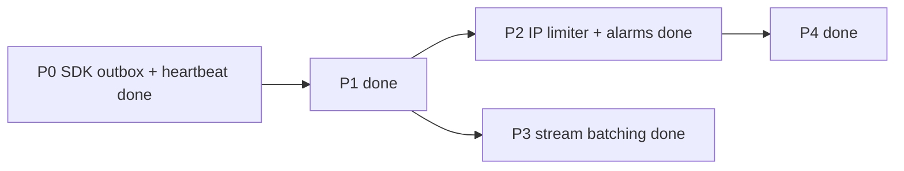

# FluxyChat -- research synthesis (local clones)

Date: 2026-05-28  
Scope: all folders under `docs/research/` (11 clones).  
Product: multi-tenant **in-app chat** on Cloudflare Workers + Room DO + D1, MIT self-host, `@fluxy-chat/sdk`, operator console.

---

## Executive summary

None of these repos replace FluxyChat’s wedge. They fill gaps in **four layers**:

| Layer | Best references | FluxyChat today |
|-------|-----------------|-----------------|
| **Room DO + WS** | workers-chat-demo, durable-chat-template, partykit | Strong -- `room-do.js`, hibernation, D1 history |
| **SDK transport** | portal (partysocket), fluxy-bot (npm) | Reconnect outbox + heartbeat + WS `replay` on connect; REST replay skipped when WS snapshot wins |
| **Tenancy + ops** | open-im (concepts), free4chat (abuse) | JWT projects, KV quotas, middleware P7 |
| **Adjacent** | sent-dm (SMS), my-chat-web / workersai (AI UI) | Agents + notifications exist; polish opportunity |

**Do not pivot** toward: OpenIM/Kafka stack, ephemeral P2P rooms (free4chat), full GPL workspace (Chatsemble), or Portal-style managed platform identity.

---

## Per-repo notes

### workers-chat-demo-master (BSD-3) -- canonical

**What:** ~500-line Cloudflare reference: one `ChatRoom` DO per room, separate `RateLimiter` DO per IP, WS hibernation.

**Borrow:**
- **Public vs private room IDs** -- `newUniqueId()` vs `idFromName(name)` routing.
- **Hot path vs storage** -- broadcast socket-to-socket; KV only for history (we use D1 -- same idea).
- **`blockedMessages` queue** until client sends identity handshake -- good for “connect → then JWT/member ack” join flow.

**Skip:** ISO timestamp as storage keys; no auth/tenancy.

**Paths:** `src/chat.mjs`, `README.md`

---

### durable-chat-template-main (CF template)

**What:** React + PartyServer `Chat` DO, hibernation, messages in DO SQLite.

**Borrow:**
- **`onConnect` snapshot** -- send `{ type: "all", messages }` once so client doesn’t flash empty.
- **Typed client events** -- `add` | `update` | `all` in shared types (maps to our `message` + `history` + streaming edits).
- **Room in URL** -- `/:room` + shareable link pattern for demos.

**Skip:** SQL string concat in inserts; load-all-messages in memory.

**Paths:** `src/server/index.ts`, `src/shared.ts`, `src/client/index.tsx`

---

### partykit-main (ISC)

**What:** PartyServer, partysocket, optional partysub/partyagent (experimental).

**Borrow:**
- **`partysocket`** -- reconnecting WS, dynamic `query` for token refresh (same idea as Portal).
- **`Server` lifecycle** -- `onConnect` / `onMessage` / `broadcast` / `hibernate: true`.
- **Routing retries** in partyserver when DO wakes cold.

**Skip:** Betting core product on partysub/partyagent; demo chat has no auth/DB.

**Paths:** `packages/partyserver/src/index.ts`, `packages/partysocket/`, `fixtures/chat/`

---

### cf-chat-main (BSD-3) -- incomplete

**What:** Fork intent: Nuxt + DO + D1 + Kinde; mostly commented router.

**Borrow (concept only):** `RateLimiter` DO per IP + `ChatRoom` coordination (copy **workers-chat-demo**, not this fork).

**Skip:** Treating as working reference -- `webSocketMessage` stub, no D1 wired.

**Paths:** `src/chatroom.ts`, `src/ratellimiter.ts`, `src/router.ts`

---

### chat-state-cloudflare-do-main (MIT)

**What:** npm adapter -- DO SQLite for Chat SDK bots (locks, cache, queue, subscriptions).

**Borrow:**
- **Alarm-driven TTL sweep** -- expired locks/cache/queue in `alarm()`.
- **Distributed locks in DO SQL** -- token + expiry without Redis.
- **Shard key docs** -- prefix sharding when one DO saturates (~500–1k req/s).

**Skip:** Using as room model; it’s bot orchestration state, not user chat rooms.

**Paths:** `src/durable-object.ts`, `src/adapter.ts`

---

### workersai-main (MIT)

**What:** Full AI assistant: one DO per anonymous session, ConnectRPC + WS streaming.

**Borrow:**
- **Typed WS envelope** -- `chat.stream.create` / `response` / `done` with `eventId` + `conversationId`.
- **HTTP for CRUD, WS for stream** -- conversations list/create over RPC; tokens only on socket.
- **Drizzle migrate in DO** -- `blockConcurrencyWhile` + SQL migrations if we add DO-side hot state.

**Skip:** Single-user DO; frontend WS client without reconnect (opposite of our SDK goal).

**Paths:** `backend/src/durable.ts`, `backend/src/connect.ts`, `frontend/app/lib/websocket.ts`, `proto/chat/v1/chat.proto`

---

### portal (MIT) -- client SDK only

**What:** React SDK for hosted Portal realtime (`partysocket`).

**Borrow (patterns, not branding or API clone):**
- **WS `replay` on connect** -- query `replay` + `replayLimit`; server pushes recent messages in one envelope.
- **Optimistic send** -- client UUID; merge server echo without duplicate rows.
- **Close code 4001 → refresh token** -- proactive JWT refresh before `exp`.

**Skip:** Shipping Portal-specific endpoints; decoding JWT client-side for authz.

**Paths:** `portal-js-main/src/use-channel.ts`, `provider/realtime-provider.tsx`

---

### my-chat-web-main (private, no LICENSE)

**What:** Next + Workers AI chat UI, localStorage only.

**Borrow:**
- **`utils/queue.js`** -- batch SSE chunks (200–800ms) to cut React re-renders during agent streaming in dashboard.
- **Model router** -- one hook switching Workers AI / OpenAI / Ollama.

**Skip:** localStorage as SoT; public unauthenticated AI routes.

**Paths:** `hooks/useChat.js`, `utils/queue.js`, `app/api/chat/route.js`

---

### free4chat-cloudflare (MIT)

**What:** Ephemeral voice/text via RealtimeKit; KV room registry; `BotSession` DO for @mentions.

**Borrow:**
- **Token broker** -- Worker only mints short-lived participant tokens; heavy media off Worker.
- **Layered abuse on token route** -- origin allowlist + Turnstile + KV rate limit + max field lengths.
- **Scoped AI DO** -- per-room bot, capped history (20 msgs), hourly quota in DO storage.

**Skip:** Ephemeral messages; WebRTC data channel as primary text transport.

**Paths:** `app/src/pages/api/token.ts`, `app/src/do/BotSession.ts`

---

### open-im-server-main (Apache-2.0)

**What:** Go microservices IM (gateway, Kafka, Mongo, Redis, MinIO).

**Borrow (design only):**
- **Webhook hooks** -- before-send / modify-message extension points.
- **Hot vs cold path** -- gateway WS vs async persistence pipeline.
- **Session types** -- single / group / notification routing in one send API.

**Skip:** Entire deployment model for default FluxyChat; ops cost orders of magnitude higher.

**Paths:** `internal/msggateway/ws_server.go`, `internal/rpc/msg/send.go`, `config/`

---

### sent-dm-typescript-main (Apache-2.0)

**What:** REST SDK for Sent.dm SMS/WhatsApp.

**Borrow:**
- **Multi-channel fan-out** -- one request → per-recipient per-channel message IDs.
- **Templates + parameters** for transactional notifies.
- **Activity log API** for support debugging delivery.

**Skip:** Confusing with in-app chat transport (we already say “pair telco APIs” on /compare).

**Paths:** `src/resources/messages.ts`, `src/resources/webhooks.ts`

---

### Chatsemble-main (GPL -- local clone)

GPL full workspace; org-scoped DO + in-room agents, React Email invites.

**Borrow (concepts only):** org vs room scoping, transactional invite email patterns → map to FluxyChat `project_id` + your Clerk/Resend; see [`chatsemble-concepts.md`](./chatsemble-concepts.md).

**Skip:** Any code import. Full workspace pivot.

---

## Cross-repo matrix

| Repo | Room DO | D1 / persist | Multi-tenant | SDK reconnect | Agents | Best steal |
|------|---------|--------------|--------------|---------------|--------|------------|
| workers-chat-demo | ✅ | KV demo | ❌ | Basic | ❌ | IP limiter DO, join buffer |
| durable-chat-template | ✅ | DO SQL | ❌ | partysocket | ❌ | onConnect snapshot |
| partykit | ✅ | optional | ❌ | partysocket | experimental | WS client DX |
| portal SDK | opaque | REST+replay | env:id | partysocket | ❌ | replay envelope, optimistic UUID |
| workersai | ✅ | DO SQL | ❌ | weak | ✅ | typed stream events |
| chat-state DO | locks | DO SQL | shard docs | N/A | bots | alarms/TTL |
| free4chat | KV+RTK | ❌ | ❌ | RTK | bot DO | abuse layers |
| open-im | ✅ | Mongo | ✅ | gateway | ❌ | webhook hooks |
| sent-dm | N/A | API | ✅ | N/A | N/A | SMS fan-out |
| cf-chat | partial | planned | planned | hibernation | game stub | use demo instead |

---

## What FluxyChat already does well

Do not rebuild these; document and market them:

- Room-per-DO + WS hibernation (`room-do.js`)
- D1 history + `loadMore` / REST pagination
- SDK reconnect backoff + `connectionState` + SSE/polling fallback
- `clientMessageId` optimistic send + retry
- Agent `tool_call` / `tool_result` on same timeline
- P7: middleware, read/unread, in-app notifications, quickstart
- Project-scoped JWT, webhooks, operator console
- Server already answers `{ type: "ping" }` → `pong` (client doesn’t send ping yet)

---

## Prioritized backlog (from research)

### P0 -- SDK transport (portal + fluxy-bot + partykit) -- **done 2026-05-28**

| Item | Inspired by | Status |
|------|-------------|--------|
| Outbound queue while `reconnecting` | fluxy-bot, partysocket | ✅ `room-connection.ts` |
| Client heartbeat `{ type: "ping" }` every 25s | fluxy-bot + room-do pong | ✅ |
| Spec: [ws-client-benchmark-fluxy.md](./ws-client-benchmark-fluxy.md) | | |

### P1 -- Join / reconnect UX (portal + workers-chat-demo + durable-chat-template) -- **done 2026-05-28**

| Item | Inspired by | Status |
|------|-------------|--------|
| WS **`history` or `replay` envelope on connect** | portal `replay`, template `type: "all"` | ✅ `replay`/`replayLimit` query; SDK `connect()` + skip REST if WS snapshot first |
| **Inbound buffer until snapshot** | workers-chat-demo `blockedMessages` | ✅ `wsInboundQueues` in `room-do.js` |
| **`streamState` on reconnect** | portal / workersai | ✅ partial agent stream row from D1 when `activeStreams` active |
| **Document** partysocket-style token in query refresh | portal | Open -- reconnect URL already passes fresh JWT via `FluxyChatClient` |

### P2 -- Worker / edge hardening -- **done 2026-05-28**

| Item | Inspired by | Status |
|------|-------------|--------|
| **Optional IP-scoped RateLimiter DO** | workers-chat-demo | ✅ `IpRateLimiterDurableObject` + `RATE_LIMIT_WS_CONNECTIONS_PER_MINUTE`; KV fallback |
| **Alarm TTL cleanup** for ephemeral DO state | chat-state-cloudflare-do | ✅ Room DO `alarm()` prunes `wsRateLimitStore` + `moderationCache` |
| **Webhook “before persist” hooks** (extend middleware story) | open-im | Open -- middleware already exists; docs only |

### P3 -- Console / agent UX -- **done 2026-05-28**

| Item | Inspired by | Status |
|------|-------------|--------|
| **Stream chunk batching** in agent room UI | my-chat-web `queue.js` | ✅ `createStreamingEditBatcher` in SDK `room-session` (all `useChat` consumers) |
| **Typed agent stream events** (optional) | workersai | ✅ `streamState` on reconnect (P1) |
| **Bot DO pattern** for heavy agent workloads | free4chat `BotSession` | Deferred -- only if Room DO CPU becomes bottleneck |

### P4 -- Product / GTM (docs & integrations) -- **done 2026-05-28**

| Item | Inspired by | Status |
|------|-------------|--------|
| **SMS/WhatsApp notify cookbook** | sent-dm | ✅ Cookbook + optional built-in `offline-notify-sent.js` (Sent.dm env + member `smsE164` prefs) |
| **Abuse checklist** on public demo/token routes | free4chat | ✅ Turnstile, `DEMO_ALLOWED_ORIGINS`, IP RL; [`public-demo-hardening.md`](../cookbook/public-demo-hardening.md) |
| **Chatsemble concepts** (no GPL import) | Chatsemble | ✅ [`chatsemble-concepts.md`](./chatsemble-concepts.md) |
| Keep **compare** positioning vs PartyKit / OpenIM / helpdesk | all | Ongoing -- no scope creep |

### Explicitly out of scope

- OpenIM-style Kafka/Mongo deployment
- PartyKit partysub/partysagent as core
- RealtimeKit as text transport
- Cloning Portal API or naming Portal on site
- Importing Chatsemble GPL code

---

## Suggested implementation order (next 2–3 weeks)

1. **Next:** Production tuning (`RATE_LIMIT_WS_CONNECTIONS_PER_MINUTE`, Turnstile on `/demo`) and optional Sent.dm webhook worker in your tenant.
2. **Deploy:** Wrangler migration `v2` for `IpRateLimiterDurableObject` if using IP DO binding.

---

## Research hygiene

- **Chatsemble:** add clone to `docs/research/` only for GPL-free reading; never merge code.
- **portal:** keep folder for SDK study; public docs say “managed channel SDK patterns” not vendor name.
- **Updates:** when implementing a backlog item, add `Implemented-YYYY-MM-DD` under the row in this file.

---

## Related internal docs

- [ws-client-benchmark-fluxy.md](./ws-client-benchmark-fluxy.md)
- [../distribution/insightscout-batch-8-hn-superglue.md](../distribution/insightscout-batch-8-hn-superglue.md)
- [../quickstart-afternoon.md](../quickstart-afternoon.md)
- [../../ROADMAP_EXECUTION.md](../../ROADMAP_EXECUTION.md)
